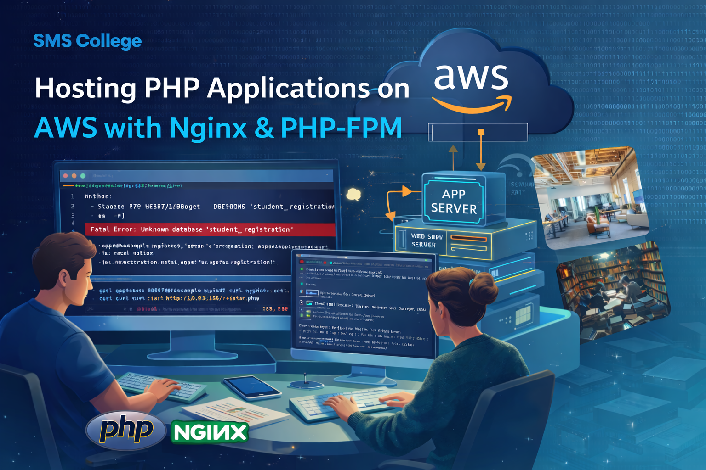
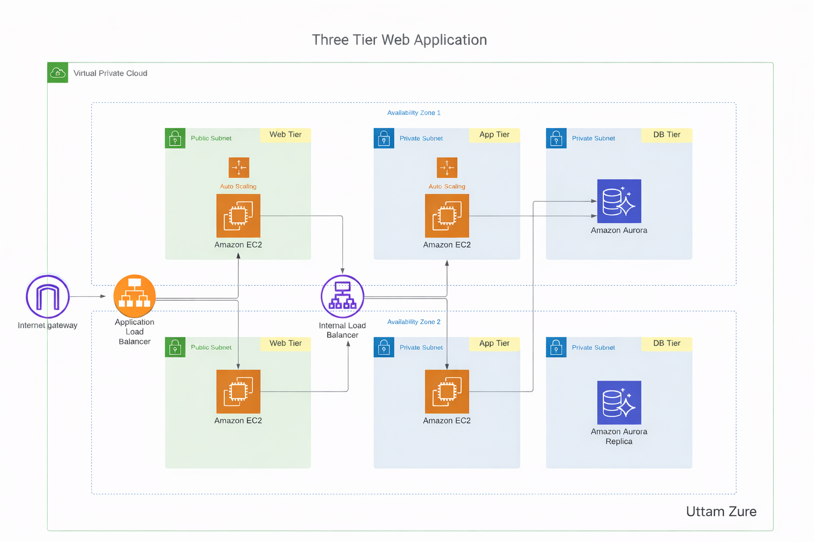
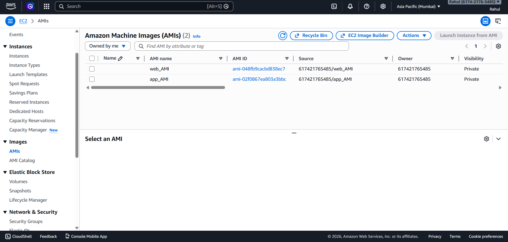
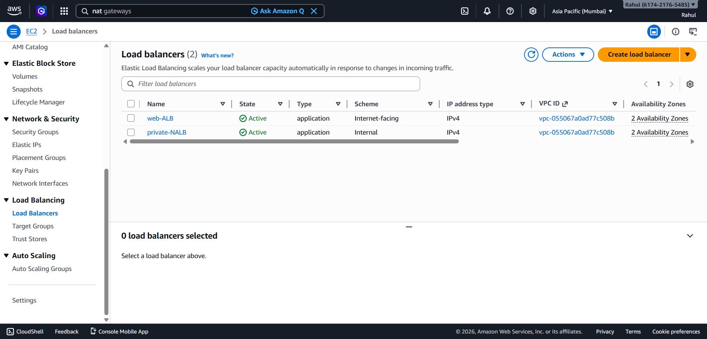
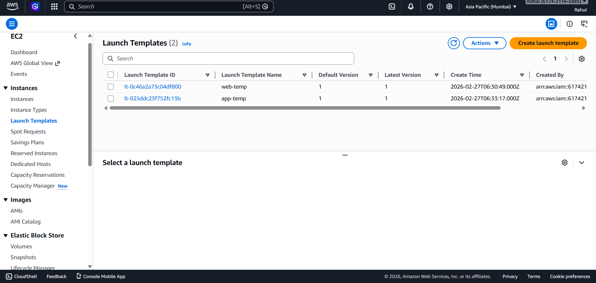
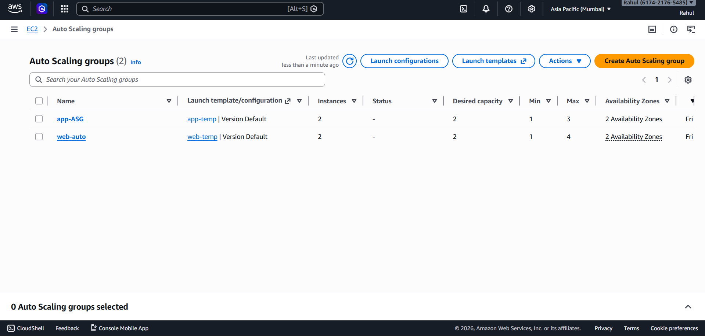
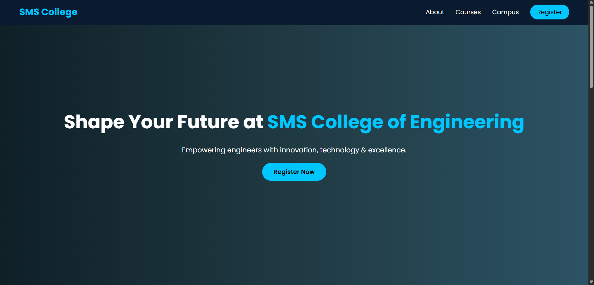
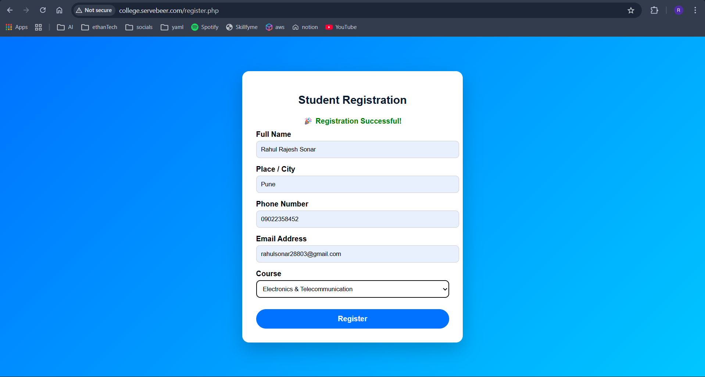
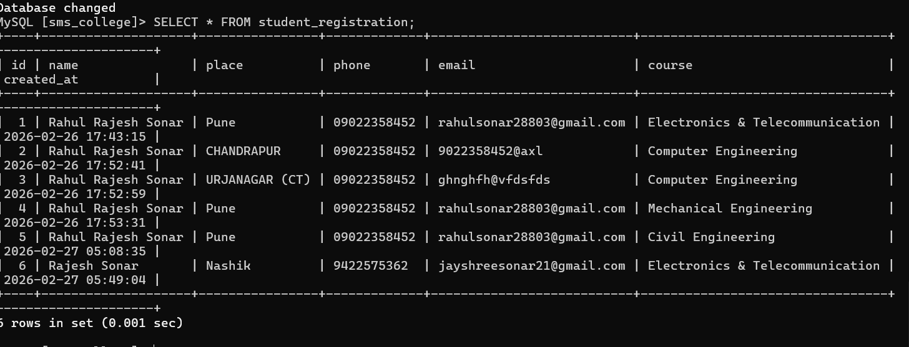

# 🏫 Campus CloudCraft: Build a College Website on AWS Using IaC

> A hands-on guide to deploying a complete, production-style college website infrastructure on AWS using CloudFormation, EC2, RDS, S3, ALB, and Auto Scaling.

📖 **Full Blog Post:** [Campus CloudCraft on Hashnode](https://rahul-sonar.hashnode.dev/campus-cloudcraft-build-a-college-website-on-aws-using-iac)
🐙 **Website Source Code:** [GitHub – college-website-project](https://github.com/sonar288/college-website-project)

---




## 📌 Table of Contents

- [Description](#description)
- [Architecture Overview](#architecture-overview)
- [AWS Services Used](#aws-services-used)
- [Prerequisites](#prerequisites)
- [Project Structure](#project-structure)
- [IaC – CloudFormation Quick Start](#️-iac--cloudformation-deployment-quick-start)
- [Part 1 – Networking & Security](#part-1--networking--security)
- [Part 2 – Instance Deployment](#part-2--instance-deployment)
- [Database Setup – Amazon RDS](#database-setup--amazon-rds)
- [Static Assets – Amazon S3](#static-assets--amazon-s3)
- [DNS Configuration – No-IP](#dns-configuration--no-ip)
- [Load Balancer & Auto Scaling](#load-balancer--auto-scaling)
- [Final Testing](#final-testing)
- [Issues Faced & Resolutions](#issues-faced--resolutions)
- [Conclusion](#conclusion)

---

## 📖 Description

This project is a hands-on guide to building and deploying a **College website infrastructure on AWS** using **CloudFormation** and **EC2**. Instead of manually configuring resources through the AWS Console, we define infrastructure as code and provision networking, compute, and security components in an automated and repeatable way.

The guide covers:
- Custom VPC with public and private subnets
- EC2 instances for web, application, and database tiers
- Security groups for controlled inter-tier access
- Amazon RDS (MySQL) for the database layer
- Amazon S3 for static asset storage
- Application Load Balancer and Auto Scaling for high availability

**Audience:** Students, beginners, and developers learning AWS deployment and IaC using CloudFormation. No advanced DevOps experience required.

---

## 🏗️ Architecture Overview




A public-facing **Application Load Balancer** distributes incoming traffic to **Web Tier EC2 instances** in public subnets. NGINX servers handle frontend requests and serve the college website. Static assets (images, media) are stored in **Amazon S3**.

API requests are forwarded via an **Internal Load Balancer** to the **Application Tier** in private subnets, which processes business logic and interacts with the **Database Tier** — a MySQL RDS instance in isolated private subnets.

```
Internet
    │
    ▼
Public ALB (Internet-facing)
    │
    ▼
Web Tier – EC2 (NGINX, Public Subnets)  ←── S3 (Static Images)
    │
    ▼
Internal ALB
    │
    ▼
App Tier – EC2 (NGINX + PHP-FPM, Private Subnets)
    │
    ▼
Database Tier – Amazon RDS MySQL (Private Subnets)
```

### Architecture Components

| Component | Details |
|---|---|
| VPC | CIDR: `10.0.0.0/16` |
| Subnets | 2 Public (Web) + 2 Private (App) + 2 Private (DB) |
| Internet Gateway | Public internet access |
| NAT Gateway | Secure outbound access from private subnets |
| Route Tables | 1 Public, 1 Private |
| Public ALB | Internet-facing, routes to Web tier |
| Internal ALB | Routes traffic from Web to App tier |
| Auto Scaling Groups | Web and App tiers |
| EC2 Instances | Web (NGINX) + App (NGINX + PHP) |
| Amazon RDS | MySQL, private subnets |
| Amazon S3 | Static images and media assets |
| Security Groups | Web SG, App SG, RDS SG |

---

## ☁️ AWS Services Used

- **Amazon VPC** – Custom isolated network
- **Amazon EC2** – Web and Application servers
- **Amazon RDS (MySQL)** – Managed relational database
- **Amazon S3** – Static asset storage
- **Application Load Balancer (ALB)** – Traffic distribution
- **Auto Scaling Groups (ASG)** – Automatic scaling
- **AWS CloudFormation** – Infrastructure as Code
- **No-IP** – Free DNS configuration
- **AWS IAM** – Access control and permissions

---

## ✅ Prerequisites

- **AWS Account** with billing enabled *(expect small charges for EC2, NAT Gateway, RDS, ALB)*
- **AWS CLI** installed and configured (`aws configure`)
- **SSH Key Pair** – create locally or via AWS Console:
  ```bash
  ssh-keygen -t rsa -b 4096 -f ~/.ssh/campus_key
  ```
- Basic knowledge of VPC, EC2, and Linux/SSH
- **CloudFormation** familiarity (Parameters, Resources, Outputs)
- **WinSCP** for file transfers (Windows users)
- Know how to clean up: `aws cloudformation delete-stack --stack-name <name>`

> ⏱ **Estimated time:** 60–120 minutes

---

## 📁 Project Structure

```
campus-cloudcraft/
│
├── index.html                           # Static website files
├── style.css   
├── register.php  
│  
│
├── vpc.yml # Full IaC template
│     
│
└── README.md
```

---

## ☁️ IaC – CloudFormation Deployment (Quick Start)

The **entire infrastructure** can be deployed automatically using the CloudFormation YAML template. It provisions the VPC, subnets, IGW, NAT Gateways, route tables, security groups, EC2 instances, and RDS instance — all in one command.

```bash
aws cloudformation create-stack \
  --stack-name campus-cloudcraft \
  --template-body file:\\vpc.yml \
  --capabilities CAPABILITY_NAMED_IAM
```


## Part 1 – Networking & Security

### Step 1: Create VPC

```
Name:          college-website-vpc
CIDR Block:    10.0.0.0/16
DNS Hostnames: Enabled
DNS Resolution: Enabled
```

<!-- INSERT IMAGE: VPC creation in AWS Console -->

### Step 2: Create Subnets

| Subnet Name | CIDR | AZ | Type |
|---|---|---|---|
| Public-Web-Subnet-1 | 10.0.1.0/24 | AZ-1 | Public |
| Public-Web-Subnet-2 | 10.0.2.0/24 | AZ-2 | Public |
| Private-App-Subnet-1 | 10.0.11.0/24 | AZ-1 | Private |
| Private-App-Subnet-2 | 10.0.12.0/24 | AZ-2 | Private |
| Private-DB-Subnet-1 | 10.0.21.0/24 | AZ-1 | Private |
| Private-DB-Subnet-2 | 10.0.22.0/24 | AZ-2 | Private |

> Enable **Auto-assign Public IP** for both public subnets.


### Step 3: Route Tables

**Public Route Table** (`college-public-rt`) → Associate: Public-Web-Subnet-1, Public-Web-Subnet-2

**Private Route Table** (`college-app-private-rt`) → Associate: all 4 private subnets

### Step 4: Internet Gateway

```
Name: college-igw
```

Attach to `college-website-vpc`, then add a route in the Public Route Table:

```
Destination: 0.0.0.0/0  →  Target: Internet Gateway
```

### Step 5: NAT Gateway

Deploy one per public subnet for high availability:

```
college-nat-az1  →  Public-Web-Subnet-1  (Allocate Elastic IP)
college-nat-az2  →  Public-Web-Subnet-2  (Allocate Elastic IP)
```

Add route in Private Route Table:
```
Destination: 0.0.0.0/0  →  Target: NAT Gateway
```


### Security Groups

**Web Security Group (`college-web-sg`)**

| Type | Port | Source |
|---|---|---|
| HTTP | 80 | 0.0.0.0/0 |
| SSH | 22 | 0.0.0.0/0 *(restrict to your IP in production)* |

**App Security Group (`college-app-sg`)**

| Type | Port | Source |
|---|---|---|
| HTTP | 80 | college-web-sg |
| SSH | 22 | college-web-sg |

**RDS Security Group (`college-rds-sg`)**

| Type | Port | Source |
|---|---|---|
| MySQL/Aurora | 3306 | college-app-sg |

<!-- INSERT IMAGE: Security Groups configuration in AWS Console -->

---

## Part 2 – Instance Deployment

### Web Server (Public Subnet)

Launch EC2:
- AMI: **Amazon Linux 2**
- Instance type: `t3.small`
- Subnet: `Public-Web-Subnet-1`
- Security Group: `college-web-sg`

Install NGINX:
```bash
sudo yum update -y
sudo yum install nginx -y
sudo systemctl start nginx
sudo systemctl enable nginx
```

Configure as Reverse Proxy:
```nginx
location / {
    proxy_pass http://<APP_PRIVATE_IP>;
    proxy_set_header Host $host;
    proxy_set_header X-Real-IP $remote_addr;
}
```

<!-- INSERT IMAGE: EC2 Web Server instance running in AWS Console -->

### App Server (Private Subnet)

Launch EC2:
- AMI: **Amazon Linux 2**
- Instance type: `t3.small`
- Subnet: `Private-App-Subnet-1`
- Security Group: `college-app-sg`

SSH via Web Server (Bastion host):
```bash
ssh -i my-key.pem ec2-user@<APP_PRIVATE_IP>
```

Install NGINX + PHP:
```bash
sudo yum install nginx php php-mysqlnd -y
sudo systemctl start nginx && sudo systemctl enable nginx
```

### Deploy Application Code

Clone from GitHub:
```bash
git clone https://github.com/sonar288/college-website-project.git
```

Or use WinSCP → upload to Web Server → SCP to App Server:
```bash
scp -i your-key.pem index.html style.css register.php ec2-user@<PRIVATE_APP_IP>:/var/www/html/
```

Move files and set permissions on App Server:
```bash
sudo mv index.html style.css register.php /usr/share/nginx/html/
sudo chown -R nginx:nginx /usr/share/nginx/html
sudo chmod -R 755 /usr/share/nginx/html
```

Configure NGINX on App Server (`/etc/nginx/conf.d/default.conf`):
```nginx
server {
    listen 80;
    server_name _;

    root /usr/share/nginx/html;
    index index.php index.html;

    location / {
        try_files $uri $uri/ =404;
    }

    location ~ \.php$ {
        include fastcgi_params;
        fastcgi_pass unix:/run/php-fpm/www.sock;
        fastcgi_index index.php;
        fastcgi_param SCRIPT_FILENAME $document_root$fastcgi_script_name;
    }
}
```

```bash
sudo nginx -t && sudo systemctl restart nginx
```

<!-- INSERT IMAGE: Website loading via App Server through proxy -->

---

## Database Setup – Amazon RDS

### Step 1: Create DB Subnet Group

```
Name:    college-db-subnet-group
VPC:     college-website-vpc
Subnets: Private-DB-Subnet-1, Private-DB-Subnet-2
```

### Step 2: Create RDS Instance

```
Engine:         MySQL (Free Tier)
Identifier:     college-db
Username:       admin
Instance Class: db.t2.micro
Storage:        20 GB (gp2)
VPC:            college-website-vpc
Subnet Group:   college-db-subnet-group
Public Access:  No
Security Group: college-rds-sg
```

<!-- INSERT IMAGE: RDS instance in AWS Console -->

### Step 3: Connect and Create Schema

From the App Server:
```bash
mysql -h <rds-endpoint> -u admin -p
```

```sql
CREATE DATABASE sms_college;
USE sms_college;

CREATE TABLE student_registration (
    id INT AUTO_INCREMENT PRIMARY KEY,
    name VARCHAR(100) NOT NULL,
    place VARCHAR(100) NOT NULL,
    phone VARCHAR(15) NOT NULL,
    email VARCHAR(100) NOT NULL,
    course VARCHAR(100) NOT NULL,
    created_at TIMESTAMP DEFAULT CURRENT_TIMESTAMP
);
```

### Step 4: Configure register.php

```bash
sudo nano /usr/share/nginx/html/register.php
```

Update the DB connection block:
```php
<?php
$servername = "your-rds-endpoint";
$username   = "admin";
$password   = "your-master-password";
$dbname     = "sms_college";

$conn = new mysqli($servername, $username, $password, $dbname);

if ($conn->connect_error) {
    die("Connection failed: " . $conn->connect_error);
}
?>
```

```bash
sudo nginx -t && sudo systemctl restart nginx
```

---

## Static Assets – Amazon S3

Instead of storing images on EC2, we use **Amazon S3** for scalability and performance.

### Create S3 Bucket

```
Name:          college-website-images-<unique-name>
Region:        Same as infrastructure
Public Access: Unblocked
```

Upload your images and make them public. Then update `index.html`:

```html
<!-- Before -->


<!-- After -->

```

```bash
sudo nginx -t && sudo systemctl restart nginx
```

<!-- INSERT IMAGE: S3 bucket with uploaded images -->

---

## DNS Configuration – No-IP

Configure a free DNS hostname at [noip.com](https://www.noip.com):

```
Record Type: A
Hostname:    collegewebsite.ddns.net
IPv4:        <Web Server Public IP>
```

Update NGINX on the Web Server:
```nginx
server {
    listen 80;
    server_name yourhostname.ddns.net;

    location / {
        proxy_pass http://<APP_PRIVATE_IP>;
        proxy_set_header Host $host;
        proxy_set_header X-Real-IP $remote_addr;
    }
}
```

```bash
sudo nginx -t && sudo systemctl restart nginx
```

<!-- INSERT IMAGE: Website accessible via DNS name in browser -->

---

## Load Balancer & Auto Scaling

### Step 1: Create AMIs

Create AMIs from both the Web Server and App Server instances. These serve as blueprints for Auto Scaling.




### Step 2: Create Target Groups

- **Web Target Group** – HTTP:80 → Web EC2 instances
- **App Target Group** – HTTP:80 → App EC2 instances

### Step 3: Create Public ALB (Internet-Facing)

```
Name:     Public-ALB
Scheme:   Internet-facing
Subnets:  Public-Web-Subnet-1, Public-Web-Subnet-2
SG:       HTTP:80, HTTPS:443
Listener: HTTP:80 → Web Target Group
```

<!-- INSERT IMAGE: Public ALB configuration in AWS Console -->

### Step 4: Create Internal ALB

```
Name:     Internal-ALB
Scheme:   Internal
Subnets:  Private-App-Subnet-1, Private-App-Subnet-2
SG:       HTTP:80 from college-web-sg
Listener: HTTP:80 → App Target Group
```




### Step 5: Create Launch Templates

Create a Launch Template for each tier using their respective AMIs. Auto Scaling uses these as blueprints to provision new instances on demand.



### Step 6: Create Auto Scaling Groups

**Web ASG:**
```
Launch Template: Web Server template
Subnets:         Public subnets
ALB Target Group: Web Target Group
Desired: 2  |  Min: 2  |  Max: 4
```

**App ASG:**
```
Launch Template: App Server template
Subnets:         Private App subnets
ALB Target Group: App Target Group
Desired: 2  |  Min: 2  |  Max: 4
```




---

## Final Testing

| Test | Steps | Expected Result |
|---|---|---|
| Homepage | `http://<ALB-DNS>` | index.html loads with S3 images and CSS |
| Registration Form | `http://<ALB-DNS>/register.php` → fill and submit | "Data inserted successfully!" |
| Database | `SELECT * FROM student_registration;` | Submitted records appear |
| Load Balancer | Access via ALB DNS | Both instances registered as healthy |
| Auto Scaling | Stop one instance | New instance launches automatically |

**Verify DB records:**
```bash
mysql -h <rds-endpoint> -u admin -p
USE sms_college;
SELECT * FROM student_registration;
```

**Debug logs:**
```bash
sudo tail -f /var/log/nginx/error.log
sudo tail -f /var/log/php-fpm/www-error.log
```

<!-- INSERT IMAGE: Registration form successfully submitting data -->
<!-- INSERT IMAGE: MySQL terminal showing stored records -->

---

## ⚠️ Issues Faced & Resolutions

### 1️⃣ 404 Error – Page Not Found

**Cause:** MySQL client was not installed on the App Server, and PHP was not responding to NGINX.

**Fix:** Install the MySQL client package and confirm PHP-FPM is running and correctly configured in `default.conf`. Check logs:
```bash
sudo tail -f /var/log/nginx/error.log
sudo tail -f /var/log/php-fpm/www-error.log
```

### 2️⃣ 500 Internal Server Error

**Cause:** Wrong database name in `register.php`. The actual DB was `sms_college` but a different name was entered.

**Fix:** Correct the `$dbname` value and restart NGINX:
```bash
sudo nginx -t && sudo systemctl restart nginx
```

> **Most common mistakes:** Wrong RDS endpoint · incorrect username or password · mismatched database name · RDS Security Group not allowing port 3306 from the App Security Group.

---

## ✅ Final Conclusion

This project delivers a complete end-to-end AWS deployment covering:

- Custom VPC with tiered network isolation
- NGINX reverse proxy on EC2 Web tier
- PHP application layer on private EC2 instances
- Amazon RDS (MySQL) for persistent data storage
- Amazon S3 for static asset hosting
- Free DNS via No-IP
- Application Load Balancer for traffic distribution
- Auto Scaling Group for fault tolerance and elasticity

The system is **highly available, fault-tolerant, scalable, and production-ready**.

---



---



---


---

## 🧹 Cleanup

To avoid ongoing AWS charges, delete all resources when done:
```bash
aws cloudformation delete-stack --stack-name campus-cloudcraft
```

> ⚠️ Manually empty the S3 bucket before deleting the stack, as non-empty buckets cannot be auto-deleted.

---

## 👨‍💻 Author

**Rahul Rajesh Sonar**

- 📝 Blog: [rahul-sonar.hashnode.dev](https://rahul-sonar.hashnode.dev)
- 🐙 GitHub: [@sonar288](https://github.com/sonar288)

---

⭐ If this project helped you, give it a star and share the blog post!

---


*Built with ❤️ for the cloud community*
